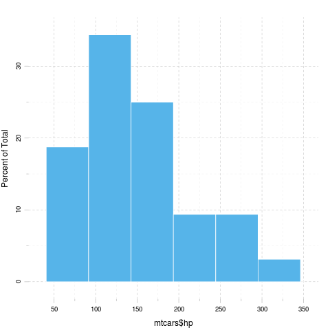
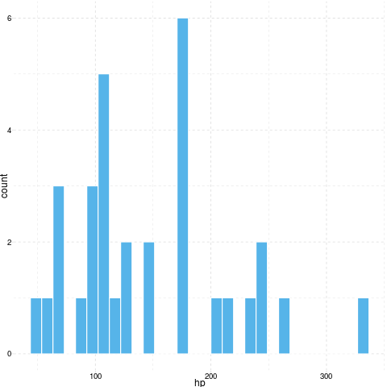

% Gergely Daróczi
% Minimal example for `Pandoc.brew`

# Introduction

We have two meta-information above:

  * author
  * title

A third field could be there too: date. For details, please check out [Pandoc's homepage](http://johnmacfarlane.net/pandoc/README.html#title-block) or just use `pandoc.title` function of this package.

As you can see writing and formatting paragraphs cannot be easier :)

But what about [R](http://www.r-project.org/)? Let us return pi: _3.142_

# R objects

`Pander.brew` would transform any returned R object to Pandoc's markdown in each code block.

For example `mtcars`'s first 5 cases look like:

-----------------------------------------------------------------------------
        &nbsp;           mpg   cyl   disp   hp   drat   wt    qsec   vs   am 
----------------------- ----- ----- ------ ---- ------ ----- ------ ---- ----
     **Mazda RX4**       21     6    160   110   3.9   2.62  16.46   0    1  

   **Mazda RX4 Wag**     21     6    160   110   3.9   2.875 17.02   0    1  

    **Datsun 710**      22.8    4    108    93   3.85  2.32  18.61   1    1  

  **Hornet 4 Drive**    21.4    6    258   110   3.08  3.215 19.44   1    0  

 **Hornet Sportabout**  18.7    8    360   175   3.15  3.44  17.02   0    0  
-----------------------------------------------------------------------------

Table: Table continues below

 
-------------------------------------
        &nbsp;           gear   carb 
----------------------- ------ ------
     **Mazda RX4**        4      4   

   **Mazda RX4 Wag**      4      4   

    **Datsun 710**        4      1   

  **Hornet 4 Drive**      3      1   

 **Hornet Sportabout**    3      2   
-------------------------------------

As you can see some formatting was added to the returned table and was also split up as the original table would have been too wide to fit on the screen (any `pander`er still using a VT100 terminal?) or standard paper. If you do not like that split up, just set the according [`panderOption`](http://rapporter.github.com/pander/#pander-options)!

We could try other R objects too, for example let us check `chisq.test` on some variables of `mtcars`:

-------------------------------------
 Test statistic   df      P value    
---------------- ---- ---------------
     20.94        2   2.831e-05 * * *
-------------------------------------

Table: Pearson's Chi-squared test: `mtcars$am` and `mtcars$gear`

 **WARNING**^[Chi-squared approximation may be incorrect]

And we got a warning above!

## Returning plot

Plots are automatically grabbed between `brew` tags and some custom formatting applied (if `evalsOptions('graph.unify')` is set to `TRUE`):

The above `lattice` looks (IMHO) pretty cool, but what about using `base` plot?

 **WARNING**^[Applying default formatting to image is somehow compromised (the result could differ from what you specified in `panderOptions`). Hints: printing `lattice`/`ggplot2` is not needed and tweaking `base` plots with `par` might have some side-effects!]

This should be quite similar by my intention :)

What about `ggplot2`?

And adding a caption is easy with even some modified `panderOptions`:

# Captions

Just like with tables:

--------------------------------------------------
   &nbsp;      Murder   Assault   UrbanPop   Rape 
------------- -------- --------- ---------- ------
 **Alabama**    13.2      236        58      21.2 

 **Alaska**      10       263        48      44.5 
--------------------------------------------------

Table: Here goes the first two lines of USArrests

# Multiple results

And the chunks can result in multiple R objects of course:

  * _1_, _2_, _3_, _4_ and _5_

<!-- end of list -->

  * _3.142_

<!-- end of list -->

  * _110_, _110_, _93_, _110_, _175_, _105_, _245_, _62_, _95_, _123_, _123_, _180_, _180_, _180_, _205_, _215_, _230_, _66_, _52_, _65_, _97_, _150_, _150_, _245_, _175_, _66_, _91_, _113_, _264_, _175_, _335_ and _109_

<!-- end of list -->

# It happens

 **ERROR**^[object 'unknown.R.object' not found] 
